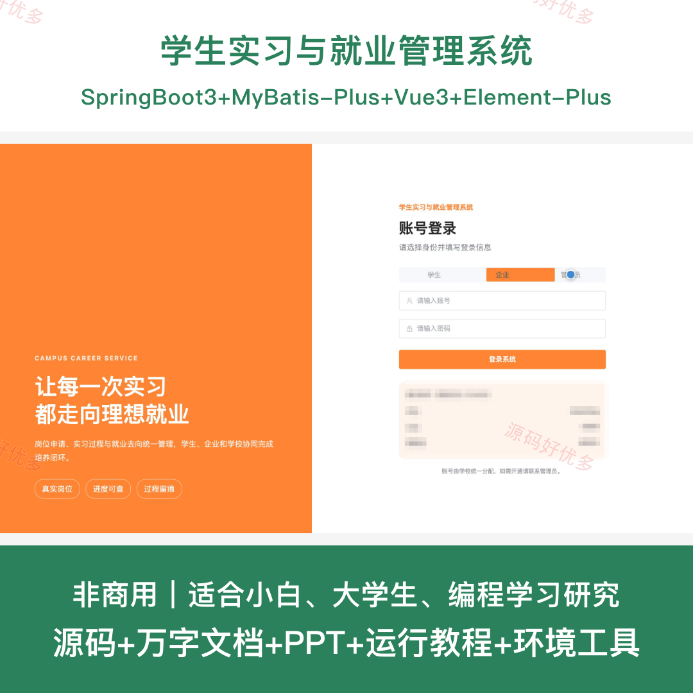
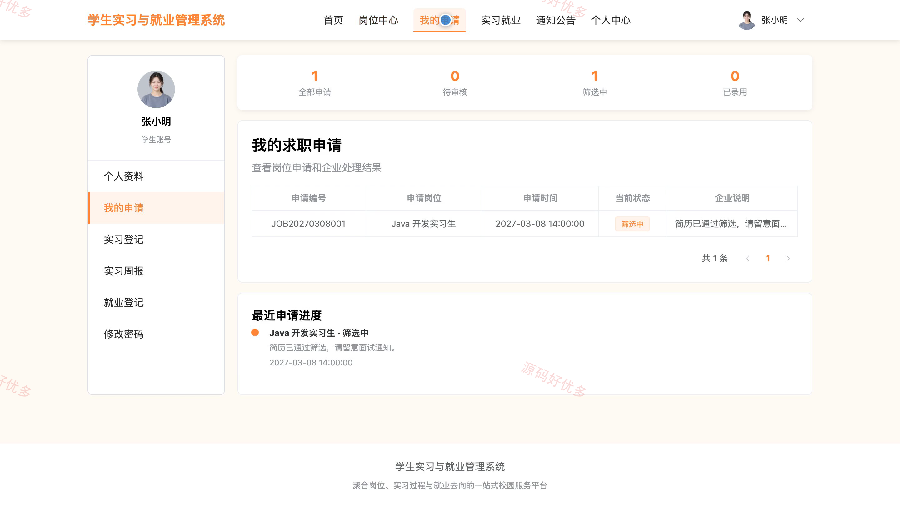
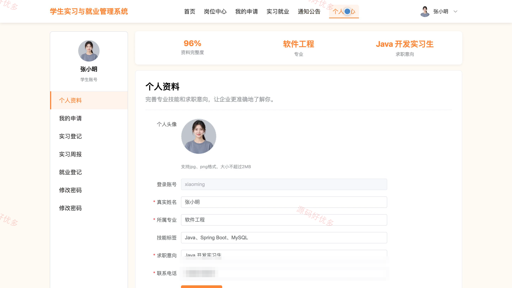
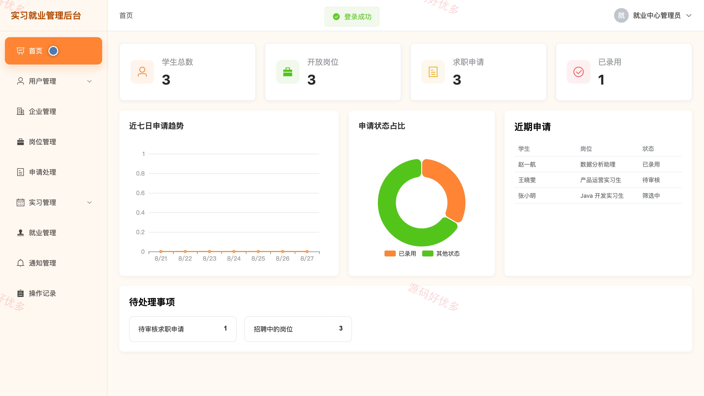
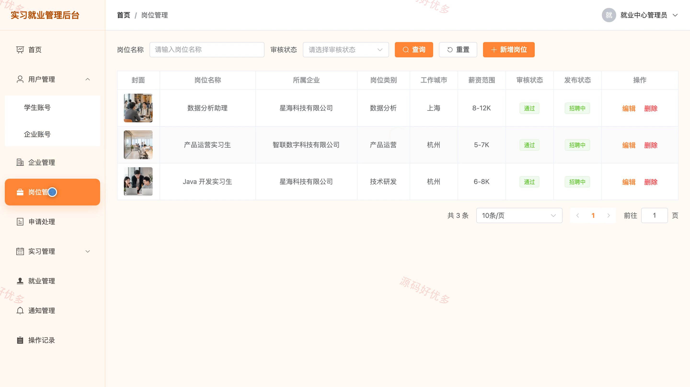
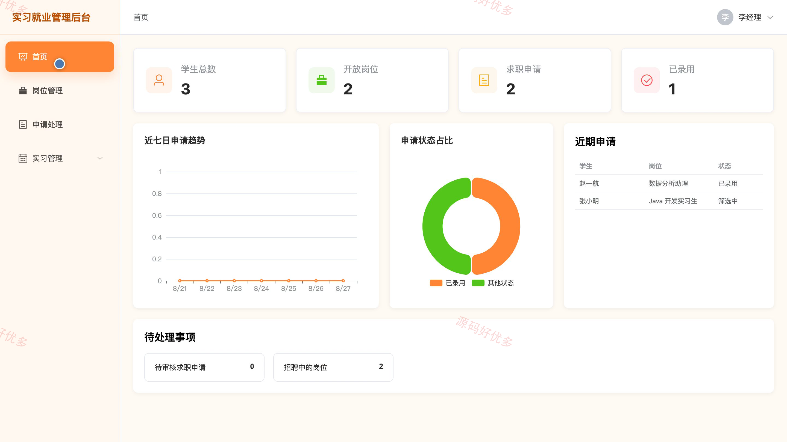
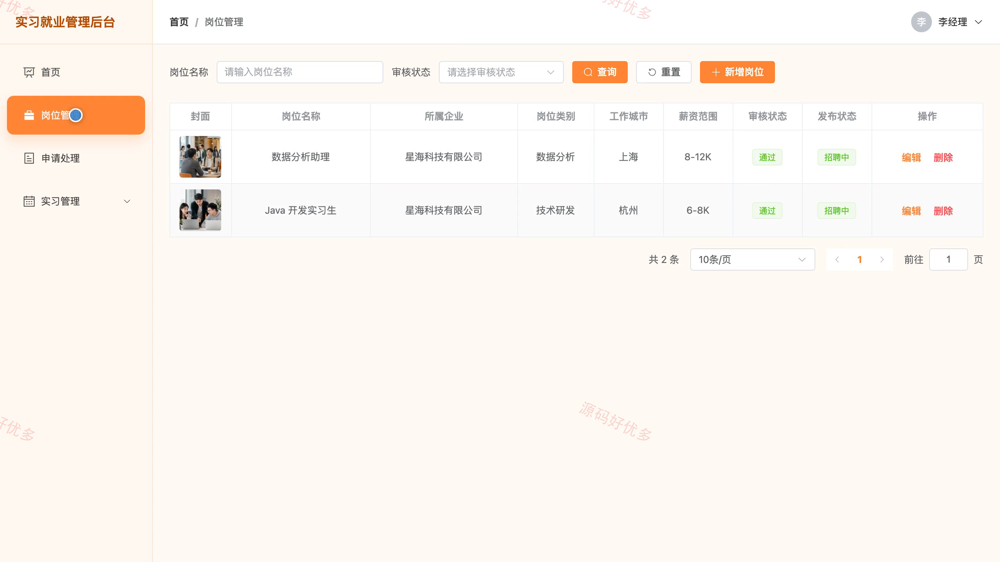

# bs082A
bs082A学生实习与就业管理系统
## 源码问题查看主页咨询

### 一、关键词
学生实习管理、大学生就业服务、校园招聘、实习岗位、就业登记

### 二、作品包含
源码+数据库+万字设计文档+PPT+全套环境和工具资源+本地部署教程

### 三、项目技术
前端技术： Html、Css、Js、Vue3.4、Element-Plus
后端技术：Java、SpringBoot3.2.0、MyBatis-Plus

### 四、运行环境（以下版本亲测，其他版本兼容性请自行测试）
开发工具：IDEA/eclipse + VSCODE

数据库：MySQL5.7+（共13张表）

数据库管理工具：Navicat10以上版本

环境配置软件： JDK17 + Maven

前端Nodejs：20

浏览器：谷歌浏览器

### 五、项目介绍
项目编号：bs082A

学生实习与就业管理系统面向学生、企业和管理员，覆盖岗位招聘、求职申请、实习过程、就业登记与审核统计，形成从岗位选择到就业去向管理的完整业务闭环。

角色：学生、企业、管理员

学生功能：账号登录、个人资料维护、岗位筛选与详情查看、求职申请与进度跟踪、实习登记、实习周报提交、就业登记、通知公告查看。

企业功能：企业账号登录、企业资料维护、岗位发布与上下架、求职申请筛选与录用、实习生状态管理、实习评价、招聘数据统计。

管理员功能：学生与企业账号管理、企业审核、岗位审核、实习过程综合管理、就业登记审核、通知公告管理、运营数据统计、操作记录查询。

### 六、运行截图

